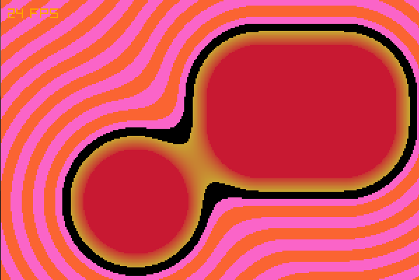

Project created to test signed distance fields in C++ using Raylib.

Features:
 - SDF calculations for circle and rectangle
 - Union with smooth min function
 - alternating colours using sine function
 - rounded corners on rectangle
 - custom resolution scaling

Controls:
 - click and drag shapes to move them
   
 - 1/2: change smoothing value of min function
 - 3/4: change rounding of rectangle corners
   
 - A/D: change amplitude of sine function
 - W/S: displace sine function
 - Q/E: change frequency of sine function
